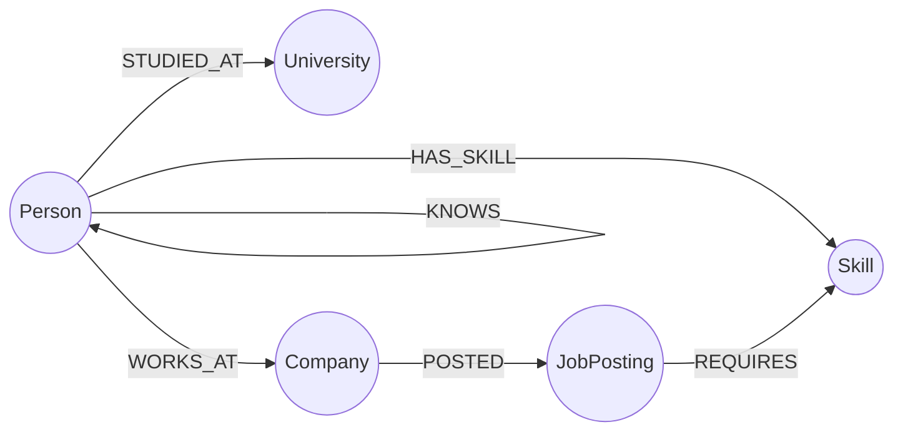

# Threadline — Alumni & Referral Network

A graph-backed app for tracing warm intros through a professional network:
who you know, who *they* know, and how that chain connects you to an open
role at a target company. Built for the Wexa AI take-home assignment on
**CognoDB**.

Live demo: https://threadline-referral-graph.onrender.com/


---

## Why a graph database?

The core question this app answers is **"how am I connected to this
company?"** — not "list all people at this company," which any relational
table handles fine, but *find the shortest or strongest chain of
professional connections between two people, of unknown and variable
length, and do it fast enough for an interactive UI.*

In PostgreSQL, a `KNOWS` edge table forces one of two approaches:

- A recursive CTE that self-joins the edge table once per hop, manually
  tracking a visited-node array to avoid infinite cycles in a network that
  is *not* a tree. This gets unreadable past 2–3 hops and the query planner
  has no good way to estimate its cost.
- Precomputing all reachable pairs up to N hops as a materialized table,
  which goes stale the moment someone adds a connection and grows
  combinatorially with network size.

In Cypher, the same question is `MATCH path = (a)-[:KNOWS*1..3]-(b)` —
variable-length path matching is a first-class part of the query language,
not a workaround. The two queries that matter most in this app
(`findWarmIntros` and `rankCandidatesForJob` in
[`backend/src/queries.ts`](backend/src/queries.ts)) each combine a
variable-length traversal with aggregation in a single pass. Expressing
either one relationally means stacking a recursive CTE, a join to the
skills table, and a `GROUP BY` on top of each other — the query stops being
something a teammate can read in one pass.

The other reason a graph model earns its place here: **the interesting
data *is* the relationships.** A person's name and headline are just
attributes; what makes the app useful is the shape of who-knows-whom,
who-studied-where, and who-has-which-skill layered together. Graph storage
keeps that shape queryable instead of flattening it into join tables that
exist purely to satisfy a relational schema.

---

## Data model



| Node | Key properties |
|---|---|
| `Person` | `id`, `name`, `headline` |
| `Company` | `id`, `name`, `industry` |
| `University` | `id`, `name` |
| `Skill` | `id`, `name` |
| `JobPosting` | `id`, `title`, `seniority` |

| Relationship | Direction | Properties | Meaning |
|---|---|---|---|
| `STUDIED_AT` | Person → University | — | alma mater |
| `WORKS_AT` | Person → Company | `role` | current employer |
| `HAS_SKILL` | Person → Skill | `level` (beginner/intermediate/advanced) | self-reported proficiency |
| `KNOWS` | Person → Person | `strength` (0–1) | professional connection / referral trust, directed |
| `POSTED` | Company → JobPosting | — | who's hiring |
| `REQUIRES` | JobPosting → Skill | — | what the role needs |

`id` is a `UNIQUE` constraint on every label (see `backend/seed/seed.ts`).

---

## Repository layout

```
backend/
  src/
    db.ts        — driver setup, connectivity check, graceful failure
    queries.ts   — every Cypher query, all parameterized
    server.ts    — Express API, wraps each route so DB errors return clean JSON
  seed/
    seedData.ts  — realistic seed data (people, companies, skills, jobs)
    seed.ts      — idempotent load script (clears graph, creates constraints, loads data)
  .env.example
frontend/
  index.html, style.css, app.js  — static vanilla-JS UI, no build step
  config.js      — points the UI at your deployed API base URL
```

---

## Setup

### 1. Create your CognoDB instance
1. Sign up at [console.cognodb.com/signup](https://console.cognodb.com/signup) (no credit card).
2. Create a free `c0` instance and pick a region.
3. Copy the `bolt+s://...` URI and the generated password for the `cognodb` user immediately — it's shown once.

### 2. Backend
```bash
cd backend
cp .env.example .env      # fill in COGNODB_URI and COGNODB_PASSWORD
npm install
npm run seed               # loads universities, companies, skills, people, jobs, connections
npm run dev                 # starts the API on http://localhost:4000
```

### 3. Frontend
```bash
cd frontend
# point config.js at your API, e.g. window.API_BASE = "http://localhost:4000";
npm run dev                # serves the static site on http://localhost:5173
```

Open `http://localhost:5173`. The status pill in the top bar shows live
whether the API can reach CognoDB.

---

## Main queries explained

All queries live in [`backend/src/queries.ts`](backend/src/queries.ts) and
are called with parameters (`$personId`, `$companyId`, …) — never string
concatenation.

**`findWarmIntros(personId, companyId)`** — the core multi-hop query.
Walks 1–3 hops of `KNOWS` from you to anyone who `WORKS_AT` the target
company, and for each path computes a combined "path strength" by
multiplying the `strength` of every edge along the way. Powers the **Warm
Intros** tab.

**`rankCandidatesForJob(jobId)`** — combines a set-overlap aggregation
(how many of a job's required skills a person has) with an `OPTIONAL
MATCH` variable-length path check (how close that person's network sits to
the hiring company). Ranks candidates by skill coverage first, network
proximity second. Powers the **Job Board** tab — this is the query a
relational schema would find most awkward, since it needs a join, a
recursive traversal, and an aggregation to agree in one query.

**`shortestPathBetween(fromId, toId)`** — a single `shortestPath()` call
across up to 6 hops. Powers the **Path Finder** tab.

**`getPersonProfile(personId)`** — a single-hop fan-out (company,
university, all skills) — included for contrast: this one *would* be a
straightforward set of joins in SQL, which is the point — not every query
here needs a graph, but the three above genuinely do.

---

## Engineering notes

- Connection details are read from environment variables (`backend/.env`,
  gitignored) — never committed.
- `backend/src/db.ts` verifies connectivity once at boot and every API
  route returns a clean `503` with a human-readable message if CognoDB is
  unreachable, instead of a stack trace.
- The frontend shows loading, empty, and error states (with retry) for
  every view — see `errorState()` and the `empty-state` class in
  `frontend/app.js`.

---

## Deployment

- **Backend**: any Node host with env var support (Render, Railway,
  Fly.io free tiers all work — `npm run build && npm start`).
- **Frontend**: any static host (Vercel, Netlify, GitHub Pages). Set
  `window.API_BASE` in `frontend/config.js` to your deployed backend URL
  before publishing.
- Keep the CognoDB instance running after submission in case the reviewer
  wants to try the app against live data.

## Screenshots


